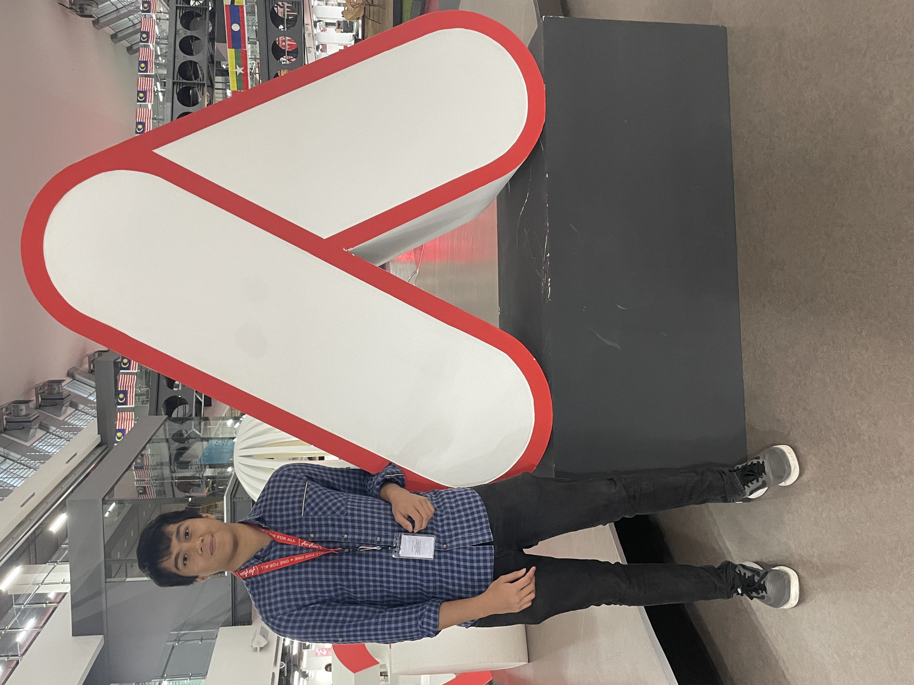

# **Hariz's User Page**

```python
print("Hello there :)")`
```
## **Welcome to my User Page!**
This page will showcase some things about me, but you are also able to search for specifc things using the contents table below:


- [**Hariz's User Page**](#harizs-user-page)
  - [**Welcome to my User Page!**](#welcome-to-my-user-page)
  - [**About me**](#about-me)
  - [**My Projects**](#my-projects)
  - [**Experiences**](#experiences)
  - [**Contact Information**](#contact-information)

You may also find my README file [here](README.md)

---
## **About me**
My name is *Hariz*...
> Pronounced like "Harris" but with a 'z' at the end...
> 
and I am currently a computer engineering student at UC San Diego. I was born in Houston, TX but have lived in Malaysia for the majority of my life! 

In my free time I enjoy playing golf/fencing and also playing video games :)



---

## **My Projects**
I have experience starting and developing projects for both coursework and out of interest. Some notable ones are listed below:

* [Klass Eats](https://github.com/hzariman/KlassEats) - Online food ordering web application for students in my high school
* [Petty Cash](https://front-end-dot-airasia-pettycash-stg.appspot.com/) - Cash Advance application for staff in Malaysian Airline company **AirAsia**
* [UCSD CSE Coursework](https://github.com/hzariman) - Projects/PAs developed for university coursework purposes


---
## **Experiences**
I feel comfortable programming in multiple languages and utilizing different frameworks. Most notably:

* Python 
  1. Flask
  1.  Django
* Javascript
  1.  Node.js
  1. Angular
* Java
* C/C++

I have also set some tasks for future things I want to learn:

- [x] Try out Swift
- [x]  Create a mobile version for past projects?

---
## **Contact Information**
Feel free to reach out to me at **hzariman@gmail.com** or **mqmegatz@ucsd.edu**!

Disclaimer: I will likely add more things to this page :)